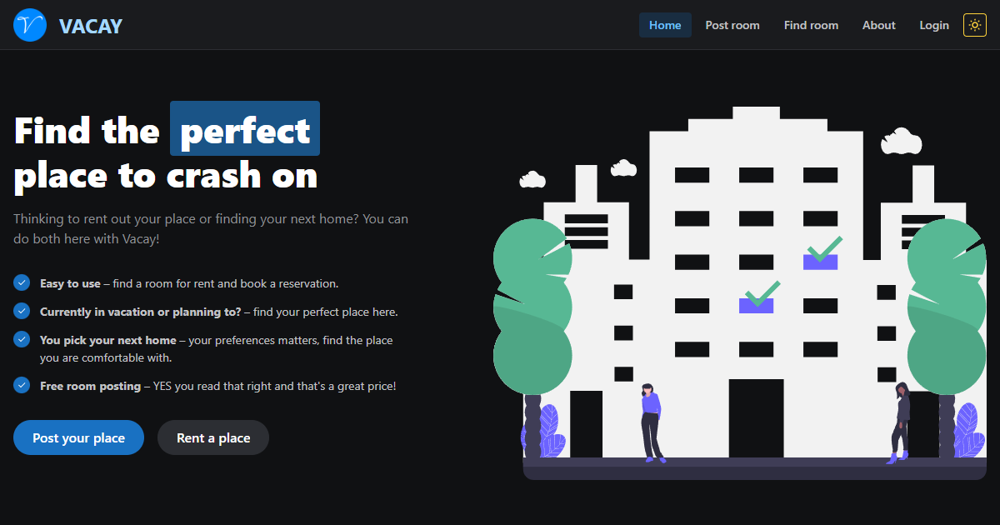

<h1 align="center"><a href='https://vacaycaraga.netlify.app/' target='_blank' rel='noreferrer'>Vacay</a></h1>

 A web app for hosting rooms within CARAGA Region for free which comes with map pinning support, listing dashboard, reservations, and many more. Click<a href="https://www.jeffreybernadas.tech/vacay" target="_blank" rel='noreferrer'> here </a>to learn more.

## ⚒️ Built with the following technologies:

<ul>
    <li>React.js</li>
    <li>Mantine UI</li>
    <li>Redux Toolkit</li>
    <li>Mapbox</li>
    <li>Node.js</li>
    <li>Express.js</li>
    <li>JWT</li>
    <li>Google OAuth 2.0</li>
    <li>Sequelize ORM</li>
    <li>MySQL</li>
    <li>Netlify (Front-end) & Heroku (Back-end) 🚀</li>
</ul>

## ✨ Features

<ul>
    <li>Create room listing</li>
        <ul>
            <li>Upload up to three (3) listing images.</li>
            <li>Pin the listing in a map.</li>
            <li>Add detailed information about it including ameneties.</li>
        </ul>
    <li>Listing</li>
        <ul>
            <li>With map pinning support.</li>
            <li>With listing reviews that can only be given by a user if their reservation is accepted by the host. One reservation = one review.</li>
        </ul>
    <li>Reservation</li>
        <ul>
            <li>An availability checker is added to every listing.</li>
            <li>Before the user reserves the place, it must first be available based on the date range the user inputted.</li>
        </ul>
    <li>Manage individual listing with a dashboard.</li>
        <ul>
            <li>Make listing appear/ disappear in feed.</li>
            <li>Accept/ Decline Reservations.</li>
            <li>View & Delete listing.</li>
        </ul>
    <li>Manage individual listing reservations.</li>
        <ul>
            <li>Accept/ Decline Reservations.</li>
            <li>Update Guest Status if they've arrived or not.</li>
        </ul>
    <li>Comes with Super Admin dashboard.</li>
        <ul>
            <li>Manage all users (View/ Delete).</li>
            <li>Manage all listings (Make them online/ offline).</li>
        </ul>
    <li>View profile of any individuals and see their most popular listing and personal information.</li>
    <li>Login using Google Account.</li>
    <li>With theming support (Light/ Dark).</li>
    <li>Mobile Responsive.</li>
</ul>

## 📝 Note

 Backend is in a seperate repository and deployed using Heroku (ClearDB). Click<a href="https://github.com/Bernz322/vacay-app-backend" target="_blank" rel='noreferrer'> here </a>for its repository.

